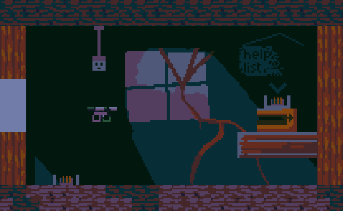
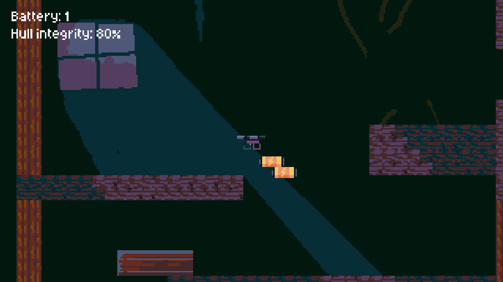
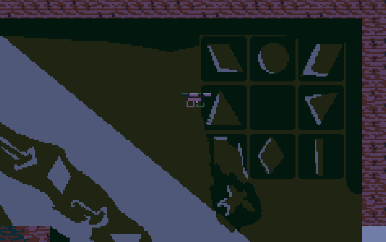

# Jammed

Jammed is a short escape room/puzzle game made in love2D using lua.

Play it on [itch.io](https://lochi-makes-games.itch.io/jammed)

## Controls

- WASD or arrow keys to move
- Enter to progress through text or confirm command
- Type into terminals

## Building

Dependencies: aseprite, npm, love2d

### Local

$ ./build-local.sh

### Web

$ ./build.sh

## AI Usage

No AI was used in this project.

## Credits

- Some code used from love2d docs including most of vectors.lua.
- Aseprite font used under [CC.BY 4.0](https://creativecommons.org/licenses/by/4.0/)
- [love.js web export](https://github.com/Davidobot/love.js)
- leather-bag-cloth-movement-5.wav by jarhead123 -- https://freesound.org/s/557401/ -- License: Attribution 3.0

